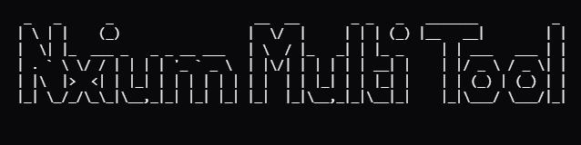

<p align="center">
  
</p>

<h1 align="center">⚙️ Nxium Python MultiTool</h1>

<p align="center">
  A customizable Python-based multitool built under the alias <strong>Nxium</strong>.
</p>

---

## 📌 About

This is a Python multi tool created by me under my alias name **Nxium**  

> **THIS IS FOR EDUCATIONAL PURPOSES ONLY**  
> **YOU CANNOT BLAME ME FOR ANY BANS YOU GET ON ANY ACCOUNTS IF YOU DISTRIBUTE ANY FILE THAT WAS CREATED BY THIS TOOL**

Made With Love By Nxium ❤️

---

## 🚀 Features

- 📂 File Generation System For Many... Lets Just Say Bad Files
- 🛠 Template Modification
- 🧩 Simple Menu-Based Interface
- ❌ Clean Exit System

---

## 🖥 Usage

1. Install Python 3.10+
2. Clone the repository:
   ```bash
   git clone https://github.com/yourusername/yourrepo.git
   cd yourrepo
